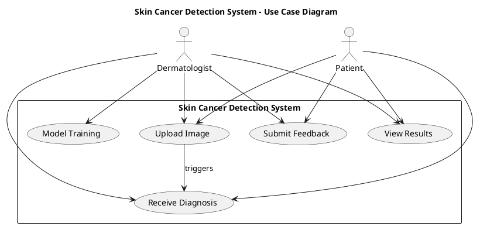
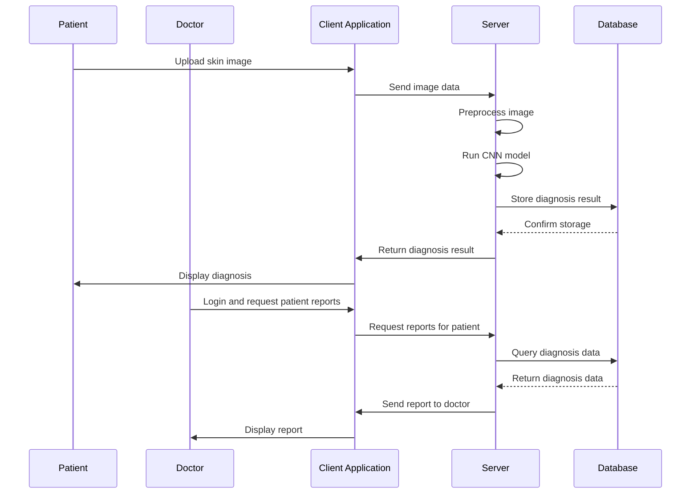
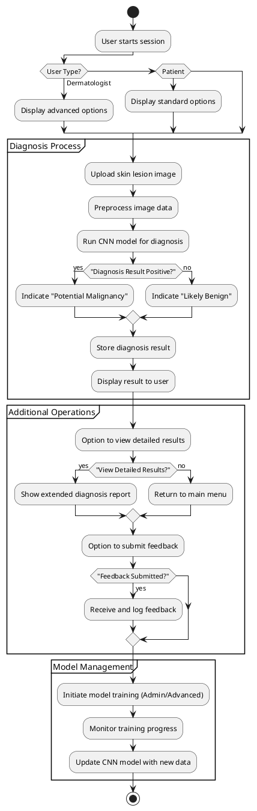
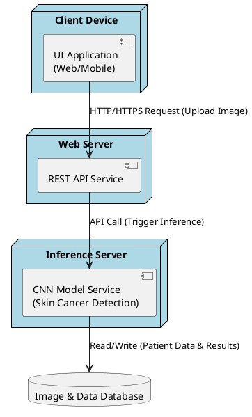

Make an overall architecture for the following
````
System Design
=============

Overview of Architecture
------------------------

The proposed architecture consists of four deep learning models—EfficientNetV2S, EfficientNetV2M, InceptionResNetV2, and XceptionNet—each trained independently on the HAM10000 dataset. These models are then combined through an ensemble averaging mechanism. The ensemble model takes the dermatoscopic image as input, preprocesses it to match the input dimensions of the models, and feeds it into each network. The resulting predictions are averaged to generate a final output. This ensemble-based approach reduces individual model biases and improves classification robustness. The final model is then integrated into a Gradio web application for real-time use.

Functional Architecture
-----------------------

The system begins with image acquisition through the web interface. The image is preprocessed—resized, normalized, and augmented as needed—before being passed to the ensemble model. Each of the four CNN models processes the image independently, and their outputs are combined. The combined prediction is then decoded into one of the seven skin cancer classes. Finally, the result, including a detailed description of the condition, is displayed to the user. This flow ensures end-to-end automation, from user input to diagnosis delivery.

Transformer Architecture (Reference)
------------------------------------

While not directly used in this project, the Transformer architecture is briefly explored for its potential future use in skin lesion classification. Originally developed for NLP, Transformers have shown success in vision tasks through Vision Transformers (ViT). These models use self-attention mechanisms to understand global image features, making them valuable for detecting skin lesions that vary greatly in appearance. In future enhancements, this architecture may replace or augment CNN-based approaches.

UML Diagrams
------------

### Use Case Diagram ###

This diagram showcases the interaction between the user (dermatologist or patient) and the system. The main use case involves uploading an image and receiving a diagnosis. Other use cases include model training, result viewing, and feedback submission.




### Sequence Diagram ###

This diagram represents the chronological flow: the user uploads an image, the image is processed, predictions are generated by the ensemble model, and the result is returned. It captures the real-time, interactive nature of the system.


### Activity Diagram ###

The activity diagram outlines the complete workflow—from system initialization, image upload, and preprocessing, to prediction generation and display. It provides a visual representation of the logic and sequence of operations, ensuring a clear understanding of system functionality.



## Deployment Diagram
This deployment diagram illustrates the architecture for a skin cancer detection system built on a convolutional neural network (CNN) model. In the diagram, a client device (which can be a web or mobile application) sends HTTP/HTTPS requests to a web server hosting a REST API, which forwards image data for analysis to an inference server where the CNN model is deployed. The inference server processes the incoming images, performs diagnosis using the trained model, and then interacts with a centralized database that stores both raw image data and the diagnostic results. This high-level overview not only outlines the data flow—from image capture to storage of results—but also identifies key considerations for production environments, such as the potential incorporation of load balancers, security measures, and additional nodes to support model training and GPU acceleration.

````
HERE IS THE GUIDE
# Architecture Diagrams Documentation (v11.1.0+) 

> In the context of mermaid-js, the architecture diagram is used to show the relationship between services and resources commonly found within the Cloud or CI/CD deployments. In an architecture diagram, services (nodes) are connected by edges. Related services can be placed within groups to better illustrate how they are organized.

## Example 

##### Code:

```
architecture-beta
    group api(cloud)[API]

    service db(database)[Database] in api
    service disk1(disk)[Storage] in api
    service disk2(disk)[Storage] in api
    service server(server)[Server] in api

    db:L -- R:server
    disk1:T -- B:server
    disk2:T -- B:db
```

⌘ + Enter|Run ▶

DatabaseStorageStorageServerAPI

## Syntax 

The building blocks of an architecture are `groups`, `services`, `edges`, and `junctions`.

For supporting components, icons are declared by surrounding the icon name with `()`, while labels are declared by surrounding the text with `[]`.

To begin an architecture diagram, use the keyword `architecture-beta`, followed by your groups, services, edges, and junctions. While each of the 3 building blocks can be declared in any order, care must be taken to ensure the identifier was previously declared by another component.

### Groups 

The syntax for declaring a group is:

```
group {group id}({icon name})[{title}] (in {parent id})?
```

Put together:

```
group public_api(cloud)[Public API]
```

creates a group identified as `public_api`, uses the icon `cloud`, and has the label `Public API`.

Additionally, groups can be placed within a group using the optional `in` keyword

```
group private_api(cloud)[Private API] in public_api
```

### Services 

The syntax for declaring a service is:

```
service {service id}({icon name})[{title}] (in {parent id})?
```

Put together:

```
service database1(database)[My Database]
```

creates the service identified as `database1`, using the icon `database`, with the label `My Database`.

If the service belongs to a group, it can be placed inside it through the optional `in`keyword

```
service database1(database)[My Database] in private_api
```

### Edges 

The syntax for declaring an edge is:

```
{serviceId}{{group}}?:{T|B|L|R} {<}?--{>}? {T|B|L|R}:{serviceId}{{group}}?
```

#### Edge Direction 

The side of the service the edge comes out of is specified by adding a colon (`:`) to the side of the service connecting to the arrow and adding `L|R|T|B`

For example:

```
db:R -- L:server
```

creates an edge between the services `db` and `server`, with the edge coming out of the right of `db` and the left of `server`.

```
db:T -- L:server
```

creates a 90 degree edge between the services `db` and `server`, with the edge coming out of the top of `db` and the left of `server`.

#### Arrows 

Arrows can be added to each side of an edge by adding `<` before the direction on the left, and/or `>` after the direction on the right.

For example:

```
subnet:R --> L:gateway
```

creates an edge with the arrow going into the `gateway` service

#### Edges out of Groups 

To have an edge go from a group to another group or service within another group, the `{group}` modifier can be added after the `serviceId`.

For example:

```
service server[Server] in groupOne
service subnet[Subnet] in groupTwo

server{group}:B --> T:subnet{group}
```

creates an edge going out of `groupOne`, adjacent to `server`, and into `groupTwo`, adjacent to `subnet`.

It's important to note that `groupId`s cannot be used for specifying edges and the `{group}` modifier can only be used for services within a group.

### Junctions 

Junctions are a special type of node which acts as a potential 4-way split between edges.

The syntax for declaring a junction is:

```
junction {junction id} (in {parent id})?
```

##### Code:

```
architecture-beta
    service left_disk(disk)[Disk]
    service top_disk(disk)[Disk]
    service bottom_disk(disk)[Disk]
    service top_gateway(internet)[Gateway]
    service bottom_gateway(internet)[Gateway]
    junction junctionCenter
    junction junctionRight

    left_disk:R -- L:junctionCenter
    top_disk:B -- T:junctionCenter
    bottom_disk:T -- B:junctionCenter
    junctionCenter:R -- L:junctionRight
    top_gateway:B -- T:junctionRight
    bottom_gateway:T -- B:junctionRight
```

⌘ + Enter|Run ▶

DiskDiskDiskGatewayGateway

## Icons 

By default, architecture diagram supports the following icons: `cloud`, `database`, `disk`, `internet`, `server`. Users can use any of the 200,000+ icons available in iconify.design, or add their own custom icons, by following the steps [here](https://mermaid.js.org/config/icons.html).

After the icons are installed, they can be used in the architecture diagram by using the format "name:icon-name", where name is the value used when registering the icon pack.

##### Code:

```
architecture-beta
    group api(logos:aws-lambda)[API]

    service db(logos:aws-aurora)[Database] in api
    service disk1(logos:aws-glacier)[Storage] in api
    service disk2(logos:aws-s3)[Storage] in api
    service server(logos:aws-ec2)[Server] in api

    db:L -- R:server
    disk1:T -- B:server
    disk2:T -- B:db
```

⌘ + Enter|Run ▶

DatabaseStorageStorageServerAPI

[](https://github.com/mermaid-js/mermaid/edit/develop/packages/mermaid/src/docs/syntax/architecture.md)